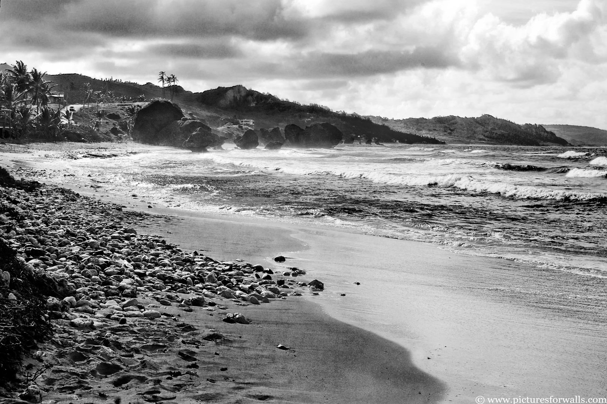
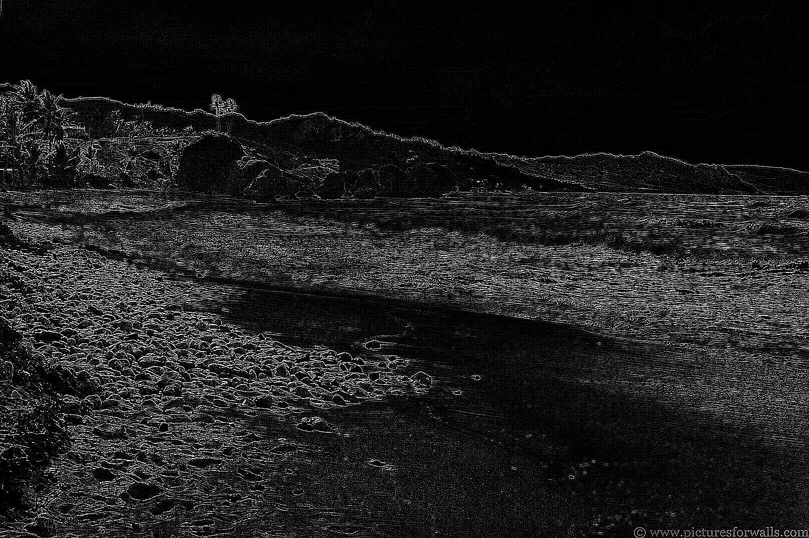
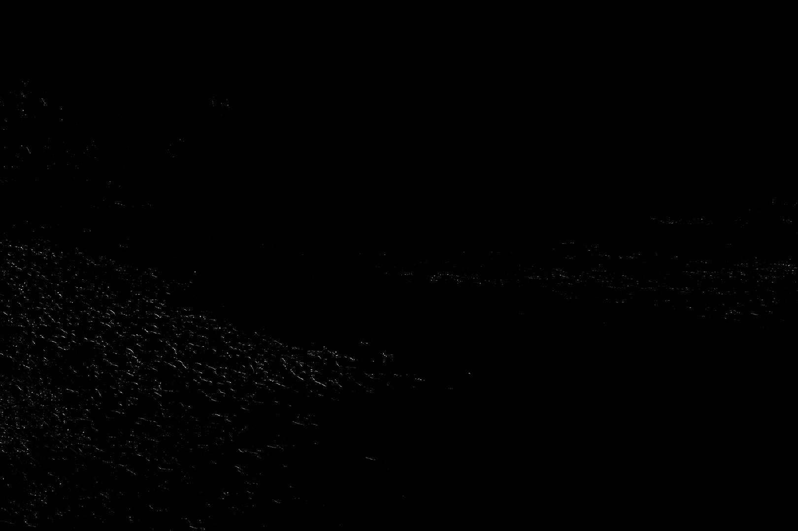
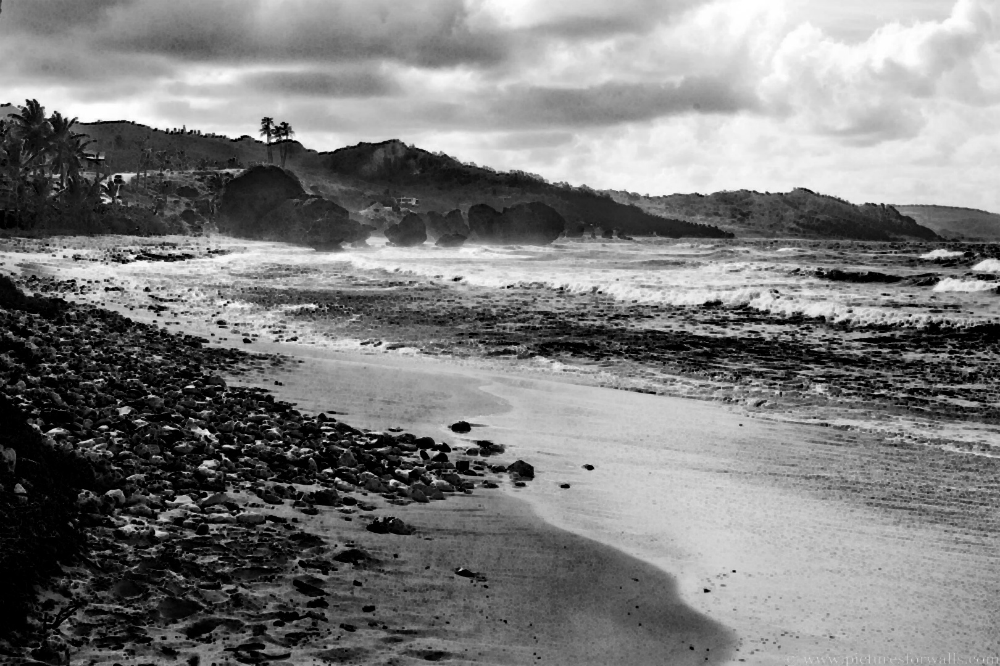
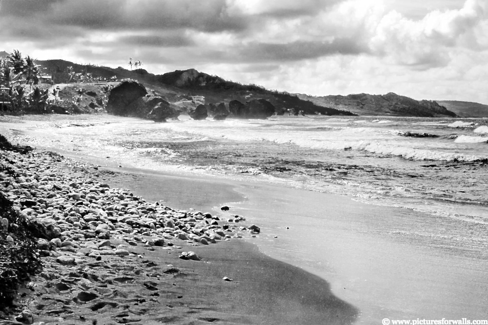
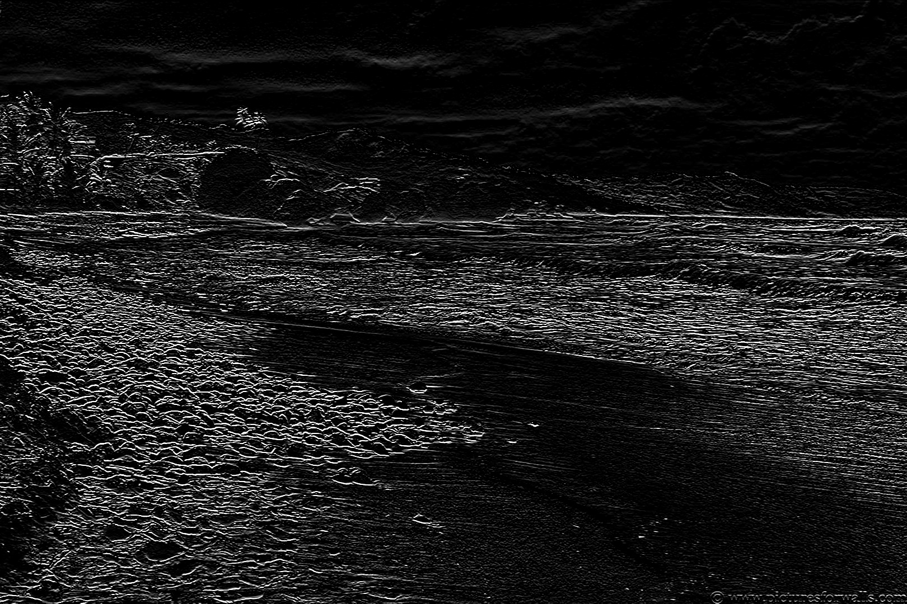
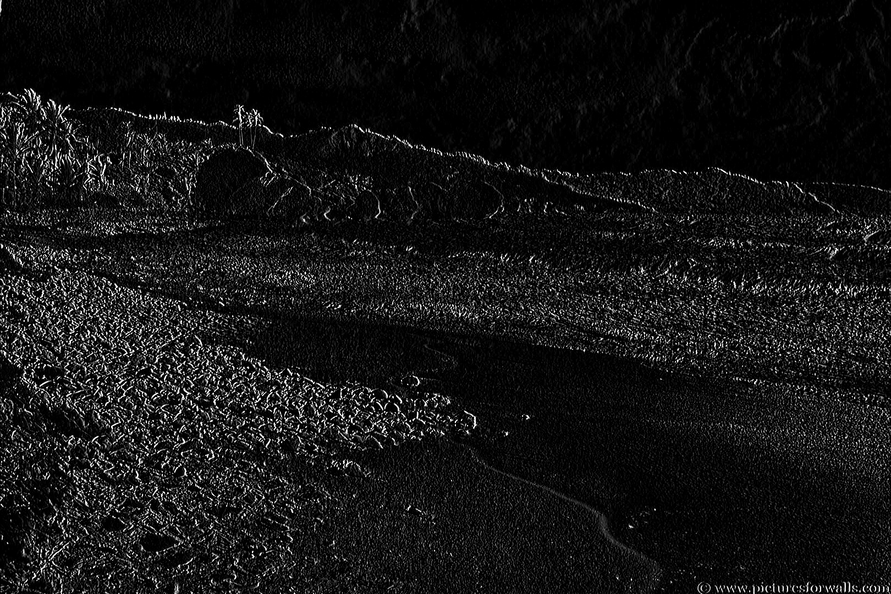
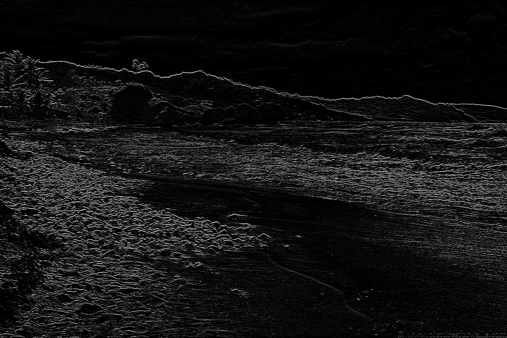

# Filters
Week 2 assignments for Vision had to do with filters. We were asked to write a program that shows the following filters:
  - Mean filter
  - Laplacian filter
  - Directional filters
  - Prewit fitler
  - Sobel filter
  - Min/Max filter
  - Matched filter
  
For the purpose a Python script was written. The needed libraries are numpy, opencv and i use skimage to rescale images.
Before showing the tests and results first lets explain how the script works.
At start the script creates the kernels needed for the filters. The kernels are used together with the other functions, so they need to be created at the start of the script.

*(the full code will be providen in the end of the document)
```python
    print("Started")
    print("Creating kernels.....")
    # construct gausian low pass kernels
    gausian_low_pass_kernel = np.array(([1, 2, 1], [2, 4, 2], [1, 2, 1]), dtype="int")
    # construct gausian high pass kernels
    laplacian_high_pass_kernel = np.array(([0, -1, 0], [-1, 4, -1], [0, -1, 0]), dtype="int")
    laplacian_high_pass_kernel_8 = np.array(([-1, -1, -1], [-1, 8, -1], [-1, -1, -1]), dtype="int")

    # construct diretional kernels
    direction_horizontal_kernel = np.array(([-1, -1, -1], [2, 2, 2], [-1, -1, -1]), dtype="int")
    direction_positive_45 = np.array(([2, -1, -1], [-1, 2, -1], [-1, -1, 2]), dtype="int")
    direction_vertical_kernel = np.array(([-1, 2, -1], [-1, 2, -1], [-1, 2, -1]), dtype="int")
    direction_negative_45 = np.array(([-1, -1, -2], [-1, 2, -1], [2, -1, -1]), dtype="int")

    # construct average blurring kernels used to smooth an image
    smallBlur = np.ones((7, 7), dtype="float") * (1.0 / (7 * 7))
    largeBlur = np.ones((21, 21), dtype="float") * (1.0 / (21 * 21))

    # construct a sharpening filter
    sharpen = np.array(([0, -1, 0], [-1, 5, -1], [0, -1, 0]), dtype="int")

    # construct the Sobel x-axis kernel
    sobelX = np.array(([-1, 0, 1], [-2, 0, 2], [-1, 0, 1]), dtype="int")

    # construct the Sobel y-axis kernel
    sobelY = np.array(([-1, -2, -1], [0, 0, 0], [1, 2, 1]), dtype="int")

    # construct the Prewit x-axis kernel
    prewitX = np.array(([1, 0, -1], [1, 0, -1], [1, 0, -1]), dtype="int")

    # construct the Prewit y-axis kernel
    prewitY = np.array(([-1, -1, -1], [0, 0, 0], [1, 1, 1]), dtype="int")

    min_max_kernel = np.ones((3, 3), dtype="int")

    matched_filter = np.array(([0, 0, 0], [1, 1, 1], [-1, -1, -1]), dtype="int")
    print("Kernels created") 
```

This is very important function that are used for every filter with the script  
```Python
     def use_kernel(img, kernel, title, min_max=None):
        gray = cv2.cvtColor(img, cv2.COLOR_BGR2GRAY)
        print("[INFO] applying {} kernel".format(title))

        if min_max == 'min':
            convoleOutput = min_operator(gray, kernel)
            opencvOutput = cv2.filter2D(gray, -1, kernel)

        elif min_max == 'max':
            convoleOutput = max_operator(gray, kernel)
            opencvOutput = cv2.filter2D(gray, -1, kernel)

        else:
            convoleOutput = convolve(gray, kernel)
            opencvOutput = cv2.filter2D(gray, -1, kernel)

        print("[INFO] DONE applying {} kernel".format(title))

        # show the output images
        cv2.imshow("original", gray)
        cv2.imshow("{} - convole".format(title), convoleOutput)
        cv2.imshow("{} - opencv".format(title), opencvOutput)
        cv2.imwrite("{} - convole.jpg".format(title), convoleOutput)
        cv2.imwrite("{} - opencv.jpg".format(title), opencvOutput)
```

This function is used with every filter. as paramaters it needs input image, the kernel that is going to be applied, title for the image and min_max flag ( used to set if min or max operatio is needed).
The image is converted to gray and then the filter is applied.


Next, we get the image we are using to test
```Python
    image = cv2.imread("test.jpg")
```
Next, in infinite while loop, we ask the user to select a filter to use. That will call the use kernel function and it will return and save the filtered image with the title given(depends on the choice)
```Python
    while True:
        print("Choose a kernel to use:")
        print(
            "1. gausian_low_pass_kernel || 2. laplacian_high_pass_kernel || 3. laplacian_high_pass_kernel_8 || 4. "
            "direction_horizontal_kernel || \n 5. direction_positive_45 || 6, direction_vertical_kernel || 7. "
            "direction_negative_45 || 8. smallBlur || 9. largeBlur || 10. sharpen || 11. sobelX || \n 12. sobelY || 13. "
            "prewitX || 14. prewitY || 15. Matched filter || 16. Min operator || 17. Max operator || 999 for exit")

        choice = str(input("Choose a kernel to use: "))
        print(choice)

        if choice == '1':
            use_kernel(image, gausian_low_pass_kernel, 'gausian_low_pass_kernel')
            cv2.waitKey(0)
            cv2.destroyAllWindows()

        elif choice == '2':
            use_kernel(image, laplacian_high_pass_kernel, 'laplacian_high_pass_kernel')
            cv2.waitKey(0)
            cv2.destroyAllWindows()
```
# Results

Here ill put some examples of results

- Test image
  - 
  
- Laplacian high pass filter
  - 
  
- Directional horizontal filter
  - 
  
- Directional -45 filter
  - 
  
- Minimum operator filer
  - 
  
- Maximum operator filter
  - 
  
- Prewit vertical filter
  - 
  
- Sobel horizontal filter
  - 
  
- Matched filter
  - 
  

# Python script
Here is the whole python script 
~~~Python
    import cv2
    import numpy as np
    from skimage.exposure import rescale_intensity

    def max_operator(img, kern):
        # grab the spatial dimensions of the image, along with
        # the spatial dimensions of the kernel
        (iH, iW) = img.shape[:2]
        (kH, kW) = kern.shape[:2]

        # allocate memory for the output image, taking care to
        # "pad" the borders of the input image so the spatial
        # size (i.e., width and height) are not reduced
        pad = (kW - 1) // 2
        img = cv2.copyMakeBorder(img, pad, pad, pad, pad,
                                cv2.BORDER_REPLICATE)
        output = np.zeros((iH, iW), dtype="float32")
        # loop over the input image, "sliding" the kernel across
        # each (x, y)-coordinate from left-to-right and top to
        # bottom
        for y in np.arange(pad, iH + pad):
            for x in np.arange(pad, iW + pad):
                # extract the ROI of the image by extracting the
                # *center* region of the current (x, y)-coordinates
                # dimensions
                roi = img[y - pad:y + pad + 1, x - pad:x + pad + 1]

                # perform the actual convolution by taking the
                # element-wise multiplicate between the ROI and
                # the kernel, then summing the matrix
                k = (roi * kern).max()

                # store the convolved value in the output (x,y)-
                # coordinate of the output image
                output[y - pad, x - pad] = k
        # rescale the output image to be in the range [0, 255]
        output = rescale_intensity(output, in_range=(0, 255))
        output = (output * 255).astype("uint8")

        # return the output image
        return output


    def min_operator(img, kern):
        # grab the spatial dimensions of the image, along with
        # the spatial dimensions of the kernel
        (iH, iW) = img.shape[:2]
        (kH, kW) = kern.shape[:2]

        # allocate memory for the output image, taking care to
        # "pad" the borders of the input image so the spatial
        # size (i.e., width and height) are not reduced
        pad = (kW - 1) // 2
        img = cv2.copyMakeBorder(img, pad, pad, pad, pad,
                                cv2.BORDER_REPLICATE)
        output = np.zeros((iH, iW), dtype="float32")
        # loop over the input image, "sliding" the kernel across
        # each (x, y)-coordinate from left-to-right and top to
        # bottom
        for y in np.arange(pad, iH + pad):
            for x in np.arange(pad, iW + pad):
                # extract the ROI of the image by extracting the
                # *center* region of the current (x, y)-coordinates
                # dimensions
                roi = img[y - pad:y + pad + 1, x - pad:x + pad + 1]

                # perform the actual convolution by taking the
                # element-wise multiplicate between the ROI and
                # the kernel, then summing the matrix
                k = (roi * kern).min()

                # store the convolved value in the output (x,y)-
                # coordinate of the output image
                output[y - pad, x - pad] = k
        # rescale the output image to be in the range [0, 255]
        output = rescale_intensity(output, in_range=(0, 255))
        output = (output * 255).astype("uint8")

        # return the output image
        return output


    def convolve(img, kern):
        # grab the spatial dimensions of the image, along with
        # the spatial dimensions of the kernel
        (iH, iW) = img.shape[:2]
        (kH, kW) = kern.shape[:2]

        # allocate memory for the output image, taking care to
        # "pad" the borders of the input image so the spatial
        # size (i.e., width and height) are not reduced
        pad = (kW - 1) // 2
        img = cv2.copyMakeBorder(img, pad, pad, pad, pad,
                                cv2.BORDER_REPLICATE)
        output = np.zeros((iH, iW), dtype="float32")
        # loop over the input image, "sliding" the kernel across
        # each (x, y)-coordinate from left-to-right and top to
        # bottom
        for y in np.arange(pad, iH + pad):
            for x in np.arange(pad, iW + pad):
                # extract the ROI of the image by extracting the
                # *center* region of the current (x, y)-coordinates
                # dimensions
                roi = img[y - pad:y + pad + 1, x - pad:x + pad + 1]

                # perform the actual convolution by taking the
                # element-wise multiplicate between the ROI and
                # the kernel, then summing the matrix
                k = (roi * kern).sum()

                # store the convolved value in the output (x,y)-
                # coordinate of the output image
                output[y - pad, x - pad] = k
        # rescale the output image to be in the range [0, 255]
        output = rescale_intensity(output, in_range=(0, 255))
        output = (output * 255).astype("uint8")

        # return the output image
        return output


    def use_kernel(img, kernel, title, min_max=None):
        gray = cv2.cvtColor(img, cv2.COLOR_BGR2GRAY)
        print("[INFO] applying {} kernel".format(title))

        if min_max == 'min':
            convoleOutput = min_operator(gray, kernel)
            opencvOutput = cv2.filter2D(gray, -1, kernel)

        elif min_max == 'max':
            convoleOutput = max_operator(gray, kernel)
            opencvOutput = cv2.filter2D(gray, -1, kernel)

        else:
            convoleOutput = convolve(gray, kernel)
            opencvOutput = cv2.filter2D(gray, -1, kernel)

        print("[INFO] DONE applying {} kernel".format(title))

        # show the output images
        cv2.imshow("original", gray)
        cv2.imshow("{} - convole".format(title), convoleOutput)
        cv2.imshow("{} - opencv".format(title), opencvOutput)
        cv2.imwrite("{} - convole.jpg".format(title), convoleOutput)
        cv2.imwrite("{} - opencv.jpg".format(title), opencvOutput)


    print("Started")
    print("Creating kernels.....")
    # construct gausian low pass kernels
    gausian_low_pass_kernel = np.array(([1, 2, 1], [2, 4, 2], [1, 2, 1]), dtype="int")
    # construct gausian high pass kernels
    laplacian_high_pass_kernel = np.array(([0, -1, 0], [-1, 4, -1], [0, -1, 0]), dtype="int")
    laplacian_high_pass_kernel_8 = np.array(([-1, -1, -1], [-1, 8, -1], [-1, -1, -1]), dtype="int")

    # construct diretional kernels
    direction_horizontal_kernel = np.array(([-1, -1, -1], [2, 2, 2], [-1, -1, -1]), dtype="int")
    direction_positive_45 = np.array(([2, -1, -1], [-1, 2, -1], [-1, -1, 2]), dtype="int")
    direction_vertical_kernel = np.array(([-1, 2, -1], [-1, 2, -1], [-1, 2, -1]), dtype="int")
    direction_negative_45 = np.array(([-1, -1, -2], [-1, 2, -1], [2, -1, -1]), dtype="int")

    # construct average blurring kernels used to smooth an image
    smallBlur = np.ones((7, 7), dtype="float") * (1.0 / (7 * 7))
    largeBlur = np.ones((21, 21), dtype="float") * (1.0 / (21 * 21))

    # construct a sharpening filter
    sharpen = np.array(([0, -1, 0], [-1, 5, -1], [0, -1, 0]), dtype="int")

    # construct the Sobel x-axis kernel
    sobelX = np.array(([-1, 0, 1], [-2, 0, 2], [-1, 0, 1]), dtype="int")

    # construct the Sobel y-axis kernel
    sobelY = np.array(([-1, -2, -1], [0, 0, 0], [1, 2, 1]), dtype="int")

    # construct the Prewit x-axis kernel
    prewitX = np.array(([1, 0, -1], [1, 0, -1], [1, 0, -1]), dtype="int")

    # construct the Prewit y-axis kernel
    prewitY = np.array(([-1, -1, -1], [0, 0, 0], [1, 1, 1]), dtype="int")

    min_max_kernel = np.ones((3, 3), dtype="int")

    matched_filter = np.array(([0, 0, 0], [1, 1, 1], [-1, -1, -1]), dtype="int")
    print("Kernels created")

    image = cv2.imread("test.jpg")

    while True:
        print("Choose a kernel to use:")
        print(
            "1. gausian_low_pass_kernel || 2. laplacian_high_pass_kernel || 3. laplacian_high_pass_kernel_8 || 4. "
            "direction_horizontal_kernel || \n 5. direction_positive_45 || 6, direction_vertical_kernel || 7. "
            "direction_negative_45 || 8. smallBlur || 9. largeBlur || 10. sharpen || 11. sobelX || \n 12. sobelY || 13. "
            "prewitX || 14. prewitY || 15. Matched filter || 16. Min operator || 17. Max operator || 999 for exit")

        choice = str(input("Choose a kernel to use: "))
        print(choice)

        if choice == '1':
            use_kernel(image, gausian_low_pass_kernel, 'gausian_low_pass_kernel')
            cv2.waitKey(0)
            cv2.destroyAllWindows()

        elif choice == '2':
            use_kernel(image, laplacian_high_pass_kernel, 'laplacian_high_pass_kernel')
            cv2.waitKey(0)
            cv2.destroyAllWindows()

        elif choice == '3':
            use_kernel(image, laplacian_high_pass_kernel_8, 'laplacian_high_pass_kernel_8')
            cv2.waitKey(0)
            cv2.destroyAllWindows()

        elif choice == '4':
            use_kernel(image, direction_horizontal_kernel, 'direction_horizontal_kernel')
            cv2.waitKey(0)
        elif choice == '5':
            use_kernel(image, direction_positive_45, 'direction_positive_45')
            cv2.waitKey(0)
            cv2.destroyAllWindows()

        elif choice == '6':
            use_kernel(image, direction_vertical_kernel, 'direction_vertical_kernel')
            cv2.waitKey(0)
            cv2.destroyAllWindows()

        elif choice == '7':
            use_kernel(image, direction_negative_45, 'direction_negative_45')
            cv2.waitKey(0)
            cv2.destroyAllWindows()

        elif choice == '8':
            use_kernel(image, smallBlur, 'smallBlur')
            cv2.waitKey(0)
            cv2.destroyAllWindows()

        elif choice == '9':
            use_kernel(image, largeBlur, 'largeBlur')
            cv2.waitKey(0)
            cv2.destroyAllWindows()

        elif choice == '10':
            use_kernel(image, sharpen, 'sharpen')
            cv2.waitKey(0)
            cv2.destroyAllWindows()

        elif choice == '11':
            use_kernel(image, sobelX, 'sobelX')
            cv2.waitKey(0)
            cv2.destroyAllWindows()

        elif choice == '12':
            use_kernel(image, sobelY, 'sobelY')
            cv2.waitKey(0)
            cv2.destroyAllWindows()

        elif choice == '13':
            use_kernel(image, prewitX, 'prewitX')
            cv2.waitKey(0)
            cv2.destroyAllWindows()

        elif choice == '14':
            use_kernel(image, prewitY, 'prewitY')
            cv2.waitKey(0)
            cv2.destroyAllWindows()

        elif choice == '15':
            use_kernel(image, matched_filter, 'matched_filter')
            cv2.waitKey(0)
            cv2.destroyAllWindows()

        elif choice == '16':
            use_kernel(image, min_max_kernel, 'min_operator', 'min')
            cv2.waitKey(0)
            cv2.destroyAllWindows()
        elif choice == '17':
            use_kernel(image, min_max_kernel, 'max_operator', 'max')
            cv2.waitKey(0)
            cv2.destroyAllWindows()

        elif choice == '999':
            print("Quitting program")
            break
~~~