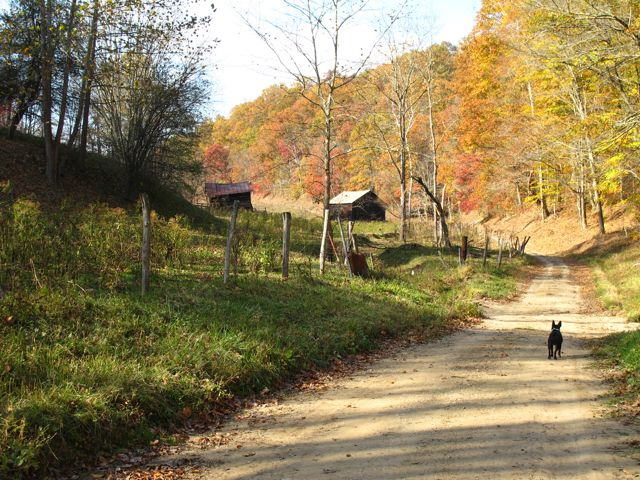
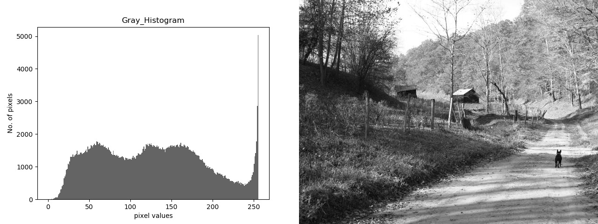
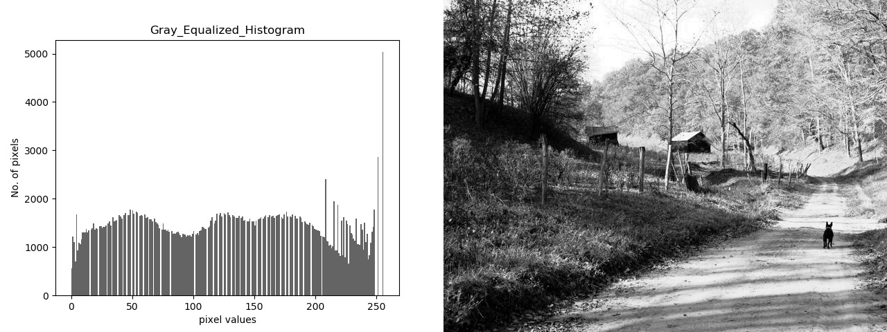

---
title: Vision - Week 1
subtitle: Histograms report Plan
author: 
- Miroslav Gechev 429556
date: \today{}
---

## Introduction
    Week 1 was introduction to the course. The assignment for the 1st week was to try the code for the histograms given in the slides. As en extra we had to implement histogram equalization (stretching) of an image. 

## Results
    For the purpose the following image was used for tests

    After converting it to gray, the histogram can be retrieved. Results can be seen here

    Histogram equalization was performed on the image and the results:

    The following script was written and tested in Python 3.5. Code can be run with
    py -*.* main.py (where *.* stands for python version- for ex py -3.5 main.py)
    After running the script, the user is given the choice to load test image, or take an image with Webcam and use that for the tests.

    # Required packages : 
        - OpenCV
        - matplotlib
        - numpy
         
~~~Python
import cv2
from matplotlib import pyplot as plt
import numpy as np

# Plots image histogram.
# @params:
#   image - image file
#   title - title for plot (string)
#   xlabel, ylabel - title for axis (string)
def plot_image_histogram(image, title, xlabel, ylabel):
    plt.title(title)
    plt.xlabel(xlabel)
    plt.ylabel(ylabel)
    plt.hist(image.ravel(), 256, [0, 256])
    plt.savefig('{}.jpg'.format(title))

    plt.show()

    histogram = cv2.imread("{}.jpg".format(title), 0)

    h1, w1 = histogram.shape[:2]
    h2, w2 = image.shape[:2]
    vis = np.zeros((max(h1, h2), w1 + w2), np.uint8)
    vis[:h1, :w1] = histogram
    vis[:h2, w1:w1 + w2] = image
    vis = cv2.cvtColor(vis, cv2.COLOR_GRAY2BGR)

    cv2.imwrite('result_{}.jpg'.format(title), vis)
    cv2.imshow('result_{}'.format(title), cv2.imread('result_{}.jpg'.format(title)))

# Converts image to gray and does histogram for the image
# @params:
# image - image file
def gray_image_histogram(image, histogram=True):
    gray_image = cv2.cvtColor(image, cv2.COLOR_BGR2GRAY)
    if histogram:
        plot_image_histogram(gray_image, "Gray Histogram", "pixel values", "No. of pixels")
    return gray_image

# Does contrast stretching for the provided image
# @params:
# image - image file
def contrast_stretching(image, histogram=True):
    gray_image = cv2.normalize(cv2.cvtColor(image, cv2.COLOR_BGR2GRAY), None, 0, 255, cv2.NORM_MINMAX)
    equalized = cv2.equalizeHist(gray_image)
    if histogram:
        plot_image_histogram(equalized, "Gray Equalized Histogram", "pixel values", "No. of pixels")
    return equalized

# Plots histogram for color image
# @params:
#   image - image file
#   title - title for plot (string)
#   xlabel, ylabel - title for axis (string)
def plot_color_image_histogram(image, title, xlabel, ylabel):
    channels = cv2.split(image)
    hist_channels = []
    eq_channels = []

    for ch, col in enumerate(channels):
        hist = cv2.calcHist([image], [ch], None, [256], [0, 256])
        hist_channels.append(hist)

    for hist in hist_channels:
        plt.plot(hist)
        plt.xlim([0, 256])
    plt.title(title)
    plt.xlabel(xlabel)
    plt.ylabel(ylabel)

    plt.savefig('{}.jpg'.format(title))
    plt.show()

    for ch, color in zip(channels, ['B', 'G', 'R']):
        eq_channels.append(cv2.equalizeHist(ch))

    eq_image = cv2.merge(eq_channels)
    plot_image_histogram(cv2.cvtColor(eq_image, cv2.COLOR_BGR2GRAY), "equalized color histogram", "pixel values", "No of pixels")
    eq_image = cv2.cvtColor(eq_image, cv2.COLOR_BGR2RGB)

    plt.title("equalized histogram")
    plt.xlabel(xlabel)
    plt.ylabel(ylabel)

    plt.imshow(eq_image)
    plt.savefig('result_{}.jpg'.format(title))
    plt.show()

def __main__():
    camera = cv2.VideoCapture(0)
    # init the webcam
    print("Enter: 1 for image | 2 for image from webcam")
    choice = input()
    if choice == "1":
        pic = cv2.imread("test.jpg")

    elif choice == "2":
        try:
            ret, frame = camera.read()
            pic = frame
            cv2.imwrite("image.jpg", pic)
        except:
            print('Warning: unable to open video source: ', 0)
            print('Using previous image')
            pic = cv2.imread("image.jpg")
    # Get histograms
    plot_color_image_histogram(pic, "Colored histogram", "pixel values", "No of pixels")
    gray_image_histogram(pic, True)
    contrast_stretching(pic, True)
    cv2.waitKey()

__main__()

~~~