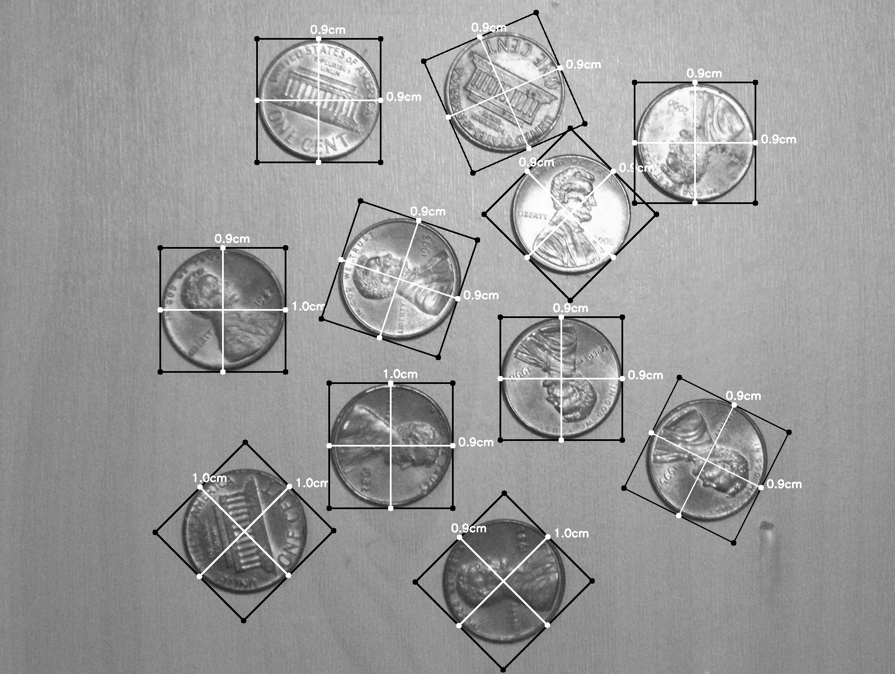

# Morphology
Week 3 assignments for Vision had to do with morphology. We were asked to write a program that shows the following:
  - Erosion - custom solution and with OpenCV
  - Dilation - custom solution and with OpenCV
  - Measure the time and compare for the custom and opencv solutions
  - Opening - with OpenCV
  - Closing - with OpenCV
  - Skeleton - with OpenCV
  - Measure the length of an object
  
## Erosion and Dilation
Erosion and Dilation are similar procesess - Erosion deletes pixels and dilation is the oposite - it adds white pixels on a white object
### Custom
- Erosion - Solution is similar to min-max operatio
```python
def custom_erosion(img):
    kern = np.ones((5, 5), dtype="int")

    print("start custom_erosion")
    t_start = start()
    # grab the spatial dimensions of the image, along with
    # the spatial dimensions of the kernel
    (iH, iW) = img.shape[:2]
    (kH, kW) = kern.shape[:2]

    # allocate memory for the output image, taking care to
    # "pad" the borders of the input image so the spatial
    # size (i.e., width and height) are not reduced
    pad = (kW - 1) // 2
    img = cv2.copyMakeBorder(img, pad, pad, pad, pad,
                             cv2.BORDER_REPLICATE)
    output = np.zeros((iH, iW), dtype="float32")
    # loop over the input image, "sliding" the kernel across
    # each (x, y)-coordinate from left-to-right and top to
    # bottom
    for y in np.arange(pad, iH + pad):
        for x in np.arange(pad, iW + pad):
            # extract the ROI of the image by extracting the
            # *center* region of the current (x, y)-coordinates
            # dimensions
            roi = img[y - pad:y + pad + 1, x - pad:x + pad + 1]

            # perform the actual convolution by taking the
            # element-wise multiplicate between the ROI and
            # the kernel, then summing the matrix
            k = (roi * kern).min()

            # store the convolved value in the output (x,y)-
            # coordinate of the output image
            output[y - pad, x - pad] = k
    # rescale the output image to be in the range [0, 255]
    output = rescale_intensity(output, in_range=(0, 255))
    output = (output * 255).astype("uint8")
    t_end = stop()
    time = elapsed(t_start, t_end)
    print("end custom_erosion. Elapsed: {}".format(time))

    # return the output image

    cv2.imwrite("custom_erosion.png", output)
    return output
``` 
- Dilation - As stated dilation is the oposite, so we take k = (roi * kern).max() instead

- Results:
    - Test image
      - 
    - Erosion - for custom the time it took to execute was: 0.14856889999999998
      -  
    - Dilation - for custom the time it took to execute was: 0.16502219999999998
      - 
        
        
      
### With opencv
With OpenCV the whole process is much simpler and faster
- Erosion
```python

def erosion(img):
    ker = np.ones((5, 5), np.uint8)

    # start timer
    # process to measure
    print("start erosion.")
    t_start = start()
    new_img = cv2.erode(img, ker, iterations=1)
    t_end = stop()
    time = elapsed(t_start, t_end)
    print("end  erosion. Elapsed: {}".format(time))

    cv2.imwrite("erosion_opencv.png", new_img)
    return new_img
```
- Dilation
```python


def dilitation(img):
    ker = np.ones((5, 5), np.uint8)
    # start timer
    # process to measure
    print("start dilitation")
    t_start = start()
    new_img = cv2.dilate(img, ker, iterations=1)
    t_end = stop()
    time = elapsed(t_start, t_end)
    print("end  dilitation. Elapsed: {}".format(time))

    cv2.imwrite("dilitation_opencv.png", new_img)

    return new_img
```
- Results
    - Test image - we use the same image  
    - Erosion - with Opencv the time it took to execute was: 0.0001358
      -   
    - Dilation - with Opencv the time it took to execute was: 4.699999999999995e-05
      - 
        
### Conclusion
The OpenCv library is huge and very optimised tool, as expected, it was much faster to use the library for the Erosion and Dilation.


## Opening and Closing
Opening and Closing are again 2 processes that counter each other - both do the same process, its just the opposite result.

### Opening
```python
def opening(img, ):
    ker = np.ones((5, 5), np.uint8)
    # start timer
    # process to measure
    print("start opening")
    t_start = start()
    new_img = cv2.morphologyEx(img, cv2.MORPH_OPEN, ker)
    t_end = stop()
    time = elapsed(t_start, t_end)
    print("end  opening. Elapsed: {}".format(time))

    cv2.imwrite("opening_opencv.png", new_img)

    return new_img
```

### Closing
```python
def closing(img, ):
    ker = np.ones((5, 5), np.uint8)
    # start timer
    # process to measure
    print("start closing")
    t_start = start()
    new_img = cv2.morphologyEx(img, cv2.MORPH_CLOSE, ker)
    t_end = stop()
    time = elapsed(t_start, t_end)
    print("end  closing. Elapsed: {}".format(time))

    cv2.imwrite("closing_opencv.png", new_img)

    return new_img
```
- Results:
    - Test image  - we use the same as the previous
       - 
    - Opening -  
      -  
    - Closing - 
      - 
## Skeleton
A skeleton of an object is a line that is midway between the boundaries of that object and which exhibits the same topology.
```python
def skeleton(img):
    skltn = np.zeros(img.shape, np.uint8)
    eroded = np.zeros(img.shape, np.uint8)
    temp = np.zeros(img.shape, np.uint8)

    print("start skeleton")
    t_start = start()
    _, thresh = cv2.threshold(img, 127, 255, 0)

    kernel = cv2.getStructuringElement(cv2.MORPH_CROSS, (3, 3))

    iters = 0
    while (True):
        cv2.erode(thresh, kernel, eroded)
        cv2.dilate(eroded, kernel, temp)
        cv2.subtract(thresh, temp, temp)
        cv2.bitwise_or(skltn, temp, skltn)
        thresh, eroded = eroded, thresh  # Swap instead of copy

        iters += 1
        if cv2.countNonZero(thresh) == 0:
            t_end = stop()
            time = elapsed(t_start, t_end)
            print("end  skeleton. Elapsed: {}".format(time))

            cv2.imwrite("skeleton_opencv.png", skltn)
            return skltn, iters

```

- Results:
    - Test image  - we use the same as the previous
      - 
    - Skeleton -  
      - 
      
## Measure length of an object
This task was more complicated to achieve. I found a tutorial i used, but it still needs some work until its finished and working on 100%
```python
def measure_length(img, width):
    i = 0
    gray = cv2.GaussianBlur(img, (7, 7), 0)
    # perform edge detection, then perform a dilation + erosion to
    # close gaps in between object edges
    edged = cv2.erode(cv2.dilate(cv2.Canny(gray, 50, 100), None, iterations=1), None, iterations=1)

    # find contours in the edge map
    cnts = cv2.findContours(edged.copy(), cv2.RETR_EXTERNAL,
                            cv2.CHAIN_APPROX_SIMPLE)
    cnts = imutils.grab_contours(cnts)

    # sort the contours from left-to-right and initialize the
    # 'pixels per metric' calibration variable
    (cnts, _) = contours.sort_contours(cnts)
    pixels_per_metric = None
    # loop over the contours individually
    for countour in cnts:
        # if the contour is not sufficiently large, ignore it
        if cv2.contourArea(countour) < 100:
            continue

        # compute the rotated bounding box of the contour
        orig = img.copy()
        box = cv2.minAreaRect(countour)
        box = cv2.cv.BoxPoints(box) if imutils.is_cv2() else cv2.boxPoints(box)
        box = np.array(box, dtype="int")

        # order the points in the contour such that they appear
        # in top-left, top-right, bottom-right, and bottom-left
        # order, then draw the outline of the rotated bounding
        # box
        box = perspective.order_points(box)
        img = cv2.drawContours(orig, [box.astype("int")], -1, (0, 255, 0), 2)

        for (x, y) in box:
            cv2.circle(orig, (int(x), int(y)), 5, (0, 0, 255), -1)
            # unpack the ordered bounding box, then compute the midpoint
            # between the top-left and top-right coordinates, followed by
            # the midpoint between bottom-left and bottom-right coordinates
            (tl, tr, br, bl) = box
            (tltrX, tltrY) = midpoint(tl, tr)
            (blbrX, blbrY) = midpoint(bl, br)

            # compute the midpoint between the top-left and top-right points,
            # followed by the midpoint between the top-righ and bottom-right
            (tlblX, tlblY) = midpoint(tl, bl)
            (trbrX, trbrY) = midpoint(tr, br)

            # draw the midpoints on the image
            cv2.circle(orig, (int(tltrX), int(tltrY)), 5, (255, 0, 0), -1)
            cv2.circle(orig, (int(blbrX), int(blbrY)), 5, (255, 0, 0), -1)
            cv2.circle(orig, (int(tlblX), int(tlblY)), 5, (255, 0, 0), -1)
            cv2.circle(orig, (int(trbrX), int(trbrY)), 5, (255, 0, 0), -1)

            # draw lines between the midpoints
            cv2.line(orig, (int(tltrX), int(tltrY)), (int(blbrX), int(blbrY)),
                     (255, 0, 255), 2)
            cv2.line(orig, (int(tlblX), int(tlblY)), (int(trbrX), int(trbrY)),
                     (255, 0, 255), 2)
            # compute the Euclidean distance between the midpoints
            dA = dist.euclidean((tltrX, tltrY), (blbrX, blbrY))
            d_b = dist.euclidean((tlblX, tlblY), (trbrX, trbrY))

            # if the pixels per metric has not been initialized, then
            # compute it as the ratio of pixels to supplied metric
            # (in this case, inches)
            if pixels_per_metric is None:
                pixels_per_metric = d_b / width
                # compute the size of the object
            dim_a = (dA / pixels_per_metric)
            dim_b = d_b / pixels_per_metric

            # draw the object sizes on the image
            cv2.putText(orig, "{:.1f}cm".format(dim_a),
                        (int(tltrX - 15), int(tltrY - 10)), cv2.FONT_HERSHEY_SIMPLEX,
                        0.65, (255, 255, 255), 2)
            cv2.putText(orig, "{:.1f}cm".format(dim_b),
                        (int(trbrX + 10), int(trbrY)), cv2.FONT_HERSHEY_SIMPLEX,
                        0.65, (255, 255, 255), 2)
        i += 1

    cv2.imwrite("object_length_{}.png".format(i), orig)
```

- Results:
    - Test image  - we use the following image for test
      - 
    - Length of an Object -  
      - 
      