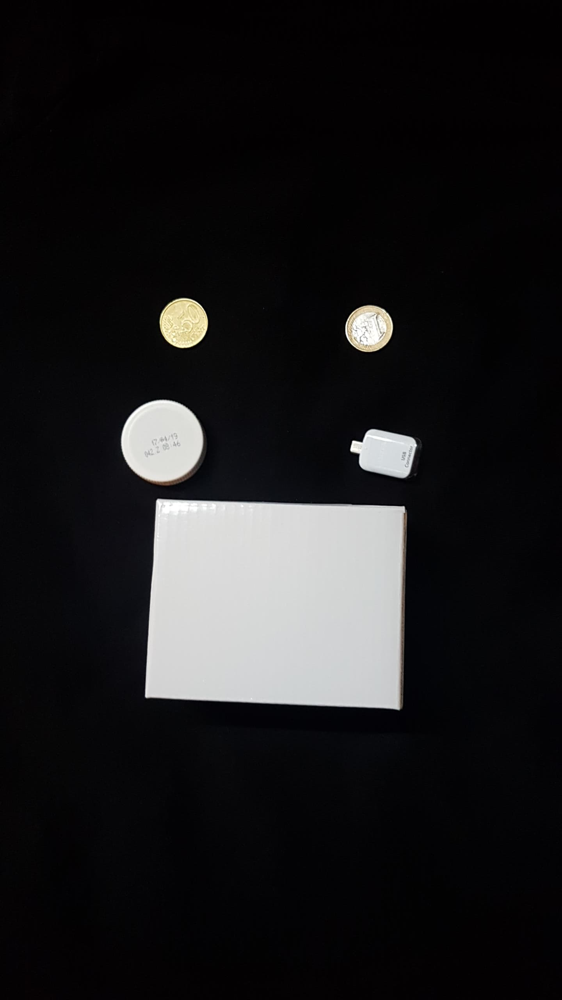
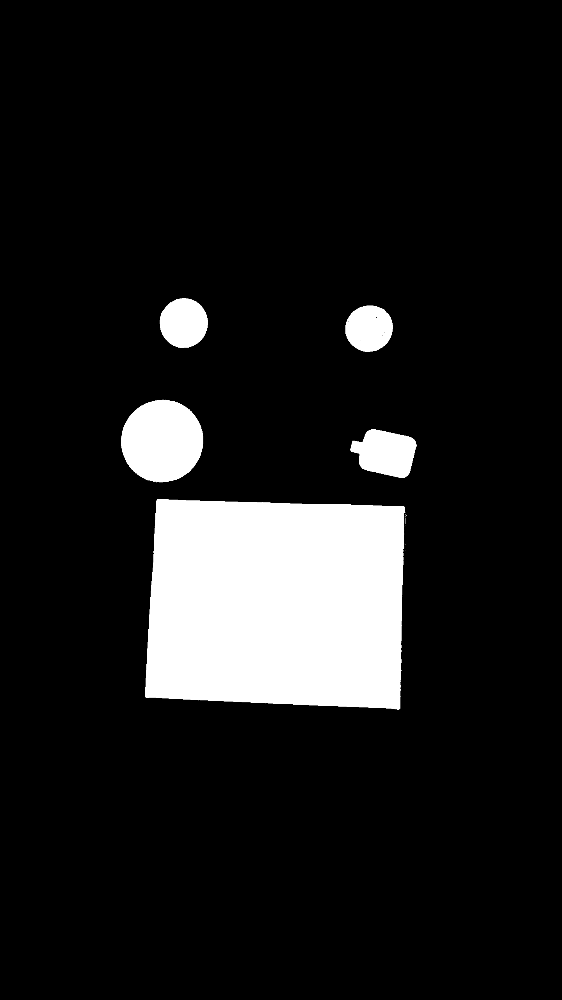
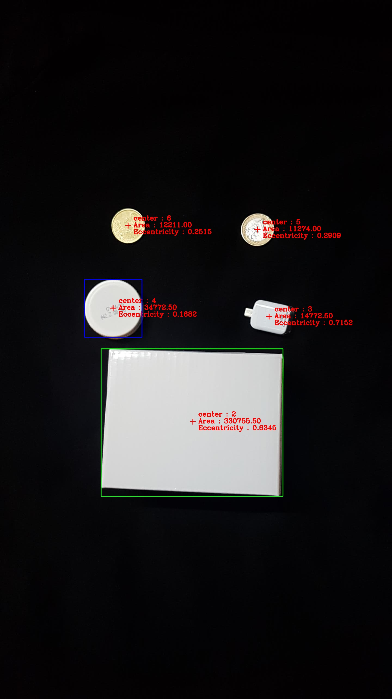

# Thresholding and region properties
- Week 5 assignment for Vision had to do with thresholding. We were asked
to write a programs showing the following: 
    - Implementation of Basicalgorithm for threhsolding
    - Implementation with OpenCV thresholding OTSU 
    - Draw a red cross at each of the object its centre of mass.
    - Draw a green bounding box around the object with the largest area.
    - Draw a blue bounding box around the object with the lowest eccentricity.

## Basic algorithm for thresholding
- The Algorithm is the following :
    - Choose initial threshold 
    - Segment the image into two groups using T 
    - Compute average intensity values for each group 
    - Compute new threshold t = 1/2(m1+m2) 
    - Repeat steps until the change of T is smaller than a predefined constant
   
### Implementation.
- I did 2 implementations of the algorithm. They are slightly different from each other. The only difference is that instead of repeating step 2, we map the pixels into a list. We reapeat steps 3-5 with values from that list.The reason i did that is because, with the basic algorithm, the task takes much more time than the OpenCV implementation, so I decided to speed things up a bit as much as i could.The results are the following.
    
    
    
- The image is with size 1440x2560. So that means we have a lot of pixels to go through. Comparison of both implementations below:
  
| Initial threshold | basic implementation | optimized |
| ----------------- | ---------------------| --------- |
| 40 | 55.293285 | 48.52720600000001 |
| 127 |39.6917548 |34.1193399 |
| 200 |54.47000010000001 |45.424552000000034 |

- Now, we see that for our test image, the optimized implementation of the basic algorithm executed at least 5 seconds faster than the basic implementation in any different case for initial threshold.
Of course, we can speed up the execution much more, if we run the code with higher error margin ( this test was done with error value 0.5 ), but that would result in more fluctuating threshold.
The OpenCV implementation of the thresholding was always done in less than a second in any case scenario.

### Results
The resulting threshold value for any case scenario was at 0.5
difference from 109, if not the same.

|Original image|
|---|
||

|Basic Optimized|
|---|
||

|OpenCV|
|---|
||

### Code

#### Basic Algorithm
```python 
## thresh
# @param:
# image - image object
# thresh - initial threshold
# const - error constant
# @return:
#   thresholded image
##
def thresh(img, thresh, const):
    print("=============== Starting job - thresh {} ===============".format(thresh))
    t_start = start()

    gray_img = cv2.cvtColor(img, cv2.COLOR_BGR2GRAY)
    initial_thresh = thresh
    iteration = 0
    while True:
        iteration += 1
        print("Starting iteration: {}".format(iteration))
        height, widght = gray_img.shape[:2]
        seg_below = []
        seg_above = []
        for y in range(height):
            for x in range(widght):
                pixel = gray_img[y, x]
                if pixel > thresh:
                    seg_above.append(gray_img[y, x])
                elif pixel <= thresh:
                    seg_below.append(gray_img[y, x])
        avg_below = np.mean(seg_below)
        avg_above = np.mean(seg_above)

        print("Avg. Below: {} ------  Avg. Above: {}".format(avg_below, avg_above))

        new_thresh = (avg_below + avg_above) * 0.5
        delta_t = abs(thresh - new_thresh)
        print("Old Threshold Value: {}".format(thresh))
        print("New Threshold Value: {}".format(new_thresh))
        print("Delta T: {}".format(delta_t))

        thresh = new_thresh
        if delta_t <= const:
            break

    print("final_thresh: {}".format(thresh))

    for y in np.arange(height):
        for x in np.arange(widght):
            pixel = gray_img[y, x]

            if pixel > thresh:
                gray_img[y, x] = 255
            elif pixel <= thresh:
                gray_img[y, x] = 0

    cv2.imwrite("thresholded_{}_{}.png".format(initial_thresh, thresh), gray_img)
    time = elapsed(t_start, stop())
    print("Elapsed time: {}".format(time))

    return thresh, time
```

#### Basic Optimized
```python
## thresh_optimized
# @param:
# image - image object
# thresh - initial threshold
# const - error constant
# @return:
#   thresholded image
##
def thresh_optimized(img, thresh, const):
    print("=============== Starting job - thresh optimized {} ===============".format(thresh))
    t_start = start()

    gray_img = cv2.cvtColor(img, cv2.COLOR_BGR2GRAY)
    initial_thresh = thresh
    iteration = 0
    height, widght = gray_img.shape[:2]
    pixels = []
    for y in range(height):
        for x in range(widght):
            pixels.append(gray_img[y, x])

    while True:
        iteration += 1
        print("Starting iteration: {}".format(iteration))

        seg_below = []
        seg_above = []
        for pixel in pixels:
            if pixel > thresh:
                seg_above.append(pixel)
            elif pixel <= thresh:
                seg_below.append(pixel)
        avg_below = np.mean(seg_below)
        avg_above = np.mean(seg_above)

        print("Avg. Below: {} ------  Avg. Above: {}".format(avg_below, avg_above))

        new_thresh = (avg_below + avg_above) * 0.5
        delta_t = abs(thresh - new_thresh)
        print("Old Threshold Value: {}".format(thresh))
        print("New Threshold Value: {}".format(new_thresh))
        print("Delta T: {}".format(delta_t))

        thresh = new_thresh
        if delta_t <= const:
            break
    print("final_thresh: {}".format(thresh))

    for pixel in pixels:
        if pixel > thresh:
            pixel = 255
        elif pixel <= thresh:
            pixel = 0

    cv2.imwrite("thresholded_optimized_{}_{}.png".format(initial_thresh, thresh), gray_img)
    time = elapsed(t_start, stop())
    print("Elapsed time: {}".format(time))

    return thresh, time
```

#### OpenCV thresholding
```python
def opencv_thresh_otsu(img, thrsh):
    print("=============== Starting job - Opencv thresh {} ===============".format(thrsh))
    t_start = start()

    img = cv2.cvtColor(img, cv2.COLOR_BGR2GRAY)
    blurred = cv2.GaussianBlur(img, (5, 5), 0)
    ret1, thresh1 = cv2.threshold(blurred, thrsh, 255, cv2.THRESH_OTSU)

    print("Elapsed time: {}".format(elapsed(t_start, stop())))
    cv2.imwrite("opencv_thresh_otsu_{}.png".format(thrsh), thresh1)
    return thresh1
```

## Find center of mass and eccentricity of objects 
- The second part of this assignment was to draw around the object with largest area, lowest eccentricity, as well as the centre of mass for each object

### Implementation
For the purpose we use the same test image. First step is to threshold the image and clean it up by converting to grayscale, blurring and thresholding it.Then we get the contours from the image. With that information we calculate the center of mass for each object. We can find the area and eccentricity for each object the same way.

#### Code
```python 
## find_countours
# @param:
# image - image object
# title - string to save the image
##
def find_countours(image, title):
    thrsh = opencv_thresh_otsu(image, 60)
    countours = cv2.findContours(thrsh.copy(), cv2.RETR_EXTERNAL, cv2.CHAIN_APPROX_NONE)
    countours = imutils.grab_contours(countours)

    largest_area = [0, ]
    previous_area = 0

    lowest_eccentricity = []
    previous_eccentricity = 0
    previous_lowest = 0
    counter = 0

    for countour in countours:
        # if the contour is not sufficiently large, ignore it
        counter += 1
        print("\n==== Counter : {}====".format(counter))
        area = cv2.contourArea(countour)

        if area < 150:
            continue

        print("== Calculating center of mass")
        M = cv2.moments(countour)
        cX = int(M["m10"] / M["m00"])
        cY = int(M["m01"] / M["m00"])
        print("== cX : {}  |  cY : {}".format(cX, cY))
        # draw the contour and center of the shape on the image
        cv2.line(image, (cX, cY - 10), (cX, cY + 10), (0, 0, 255), 2, -1)
        cv2.line(image, (cX - 10, cY), (cX + 10, cY), (0, 0, 255), 2, -1)

        print("== Last Area : {}".format(previous_area))
        print("== Current Area :  {}".format(area))

        if area >= largest_area[0]:
            (x, y, w, h) = cv2.boundingRect(countour)
            largest_area = [area, (x, y), (x + w, y + h), [cX, cY]]
            print("== Found larger Area")

        previous_area = area

        (x_centre, y_centre), (minor_axis, major_axis), angle = cv2.fitEllipse(countour)
        eccentricity = np.sqrt(1 - (minor_axis ** 2 / major_axis ** 2))

        print("== Last Eccentricity : {}".format(previous_eccentricity))
        print("== Current Eccentricity : {}".format(eccentricity))
        # print("== Current  Lowest Eccentricity : {}".format(lowest_eccentricity[0]))

        if previous_lowest == 0:
            previous_lowest = eccentricity

        elif eccentricity < previous_lowest:
            (x, y, w, h) = cv2.boundingRect(countour)
            lowest_eccentricity = [eccentricity, (x, y), (x + w, y + h), [x_centre, y_centre]]
            previous_lowest = eccentricity
            print("== Found lower eccentricity")
        previous_eccentricity = eccentricity

        cv2.putText(image, "center : {}".format(counter), (cX + 20, cY - 20),
                    cv2.FONT_HERSHEY_COMPLEX, 0.8, (0, 0, 255), 2)
        cv2.putText(image, "Area : {:06.2f}".format(area),
                    (cX + 20, cY + 5),
                    cv2.FONT_HERSHEY_COMPLEX, 0.8, (0, 0, 255), 2)
        cv2.putText(image, "Eccentricity : {:06.4f} ".format(eccentricity),
                    (cX + 20, cY + 30),
                    cv2.FONT_HERSHEY_COMPLEX, 0.8, (0, 0, 255), 2)

    print('== Largest Area : {}'.format(largest_area[0]))
    cv2.rectangle(image, (largest_area[1]), (largest_area[2]), (0, 255, 0), 2)

    print('== Lowest Eccentricity : {}'.format(lowest_eccentricity[0]))
    cv2.rectangle(image, (lowest_eccentricity[1]), (lowest_eccentricity[2]), (255, 0, 0), 2)

    cv2.imwrite('{}.jpg'.format(title), image)

    return image

```

### Results


